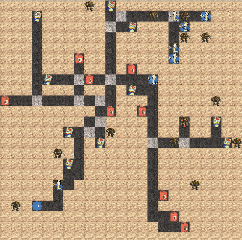

# Fallout 0 - OOP project
A simple Object Oriented Programming project.
## About
*Author: Michał Wiliński* \
*ID: 151938*

This simple project is a part of my Object Oriented Programming course. It's a simple simulation of a predator-prey system. The project is written in Java and uses JavaFX for GUI.
## How to run
To run the project you need to have Java 8+ installed. You can download it from [here](https://www.java.com/en/download/). When it comes to JavaFX, the libraries are included in the project. To run the project, you don't need to do anything special. Just run `run.sh` file which is located directly in the v1.0 LTS release. If you're using Windows (How should you feel now? Ashamed.) you can rewrite it to `run.bat` file if you want to. Or just use the WSL (Windows Subsystem for Linux) and run it as it is.
## How to use
### Disclaimer
This is a simulation of a nuclear wasteland and its harsh conditions so tread carefully! 
We don't take responsibility for damages done by:
- Radiation
- Mutants
- Super Mutants
- Ghouls
- Deathclaws
- Radscorpions
- Radroaches
- Raiders
- Greedy corporations
- The government
- Other organized human entities

### Main window
This is the view that you should probably get familiar with first. It's the main window of the application. It contains all the information about the simulation. It's divided into 3 parts:
- Animal addition panel (1)
- Selected object panel (2)
- Map panel (3)

#### Animal addition panel
This panel is used to add new animals to the simulation. It contains 3 buttons:
- Add as prey - you can spawn prey (if hideouts have enough space).
- Add as predator - you can spawn predators .
- START - you can start the simulation (or stop it if it's already running).

You also have to provide a name for the animal, in case you don't do this, the text field border will turn red.

#### Selected object panel
This panel is used to display information about the selected object. Additionally, it contains 2 buttons:
- Kill - you can kill the selected object.
- Reroute - after selecting prey, click on a path object (the light one or the darker one), the prey will then start moving towards this location.

##### Selected object panel for animal

##### Selected object panel for location

#### Map panel
It simply displays the whole world on a map. You can click a specific object to see its properties, or if it's a prey, you can reroute it.

##### An example of active simulation panel

## Final remarks
This project is under MIT license which is also accesable in this repository.

